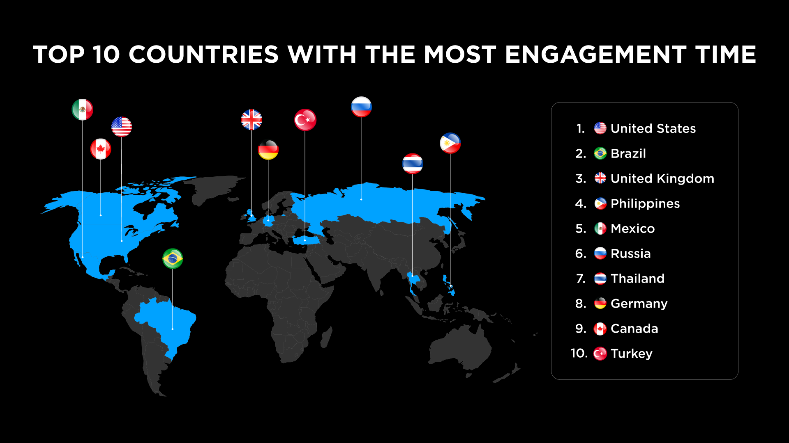
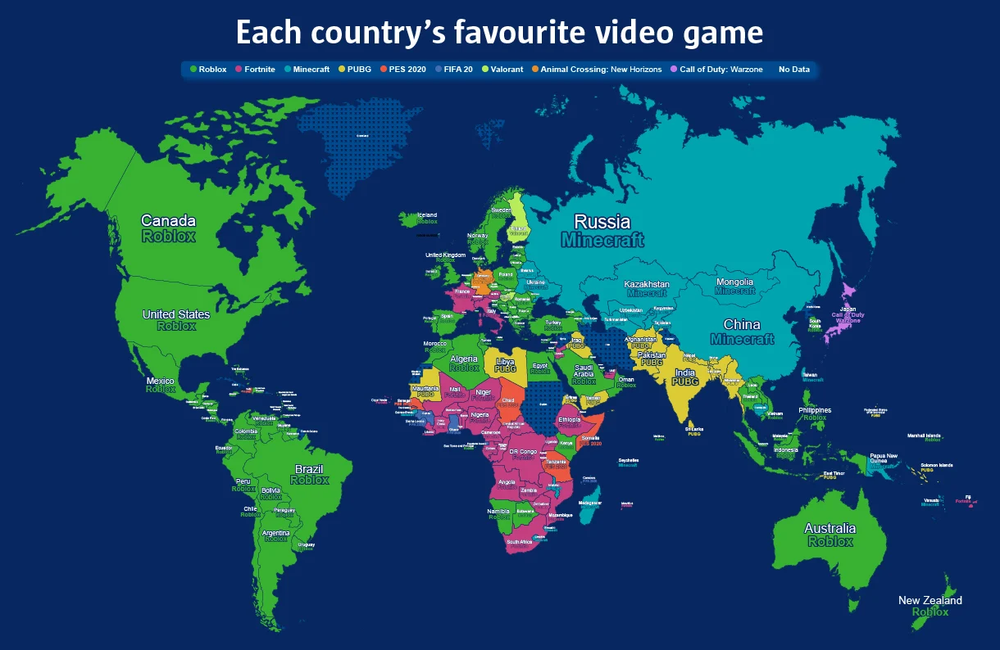

# Statistics on BRICS countries
| Country | DUA  |
| ------- | ---- |
| Brazil | 2.5m |
| Russia | 2m   |
| India  | 1m   |
| China  | Banned| 
| South Africa | 450k |
## Brazil
 - [7.8% of all players of roblox, second after US&Canada](https://labsnews.com/en/articles/business/brazil-free-mobile-games-roblox/)
 - Should be 2.5m users a day, by calculations

## Russia 
 - 6.09% of all players, third, after US&Canada and Brazil
 - [2 million active users a day](https://www.bloomberg.com/news/articles/2022-09-09/roblox-boasts-of-growth-in-russia-even-after-rivals-left)

## India
 - Second to PUBG most googled game
 - ["..hugely popular among teens in India"](https://www.tribuneindia.com/news/nation/gaming-platform-roblox-popular-among-teens-in-india-sued-for-illegally-facilitating-child-gambling-536318)
 - [2.59 subs indian roblox chanel](https://www.youtube.com/@ROCKINDIANGAMER)
 - around 1m users daily, by calculation and compresent with PUBG Mobile

## China 
__Roblox is banned in China__

## South Africa
[just under 1.5 million visits a month](https://www.iol.co.za/business-report/companies/nedbank-the-first-african-bank-to-launch-a-roblox-game-56e972f2-03dc-4471-9545-6572380bd340)

# Future members
## Argentina
  - Most googled* game in Argentina
## Egypt
  - Most googled* game in Egypt
## Ethiopia
## Iran
## Saudi Arabia
[Was banned in 2018 likely due to content deemed harmful for children. The ban was later lifted.](https://en.wikipedia.org/wiki/List_of_banned_video_games_by_country#Saudi_Arabia)
__WAS UNBANED__
## United Arab Emirates
__Roblox is banned in UAE__

# Source map

\* Data from Google Trends and Google Keyword Planner.
    https://www.reddit.com/media?url=https%3A%2F%2Fi.redd.it%2Fte0ly0khudy51.png
    https://goto.game/roblox-tops-the-list-for-worlds-most-popular-lockdown-title/

